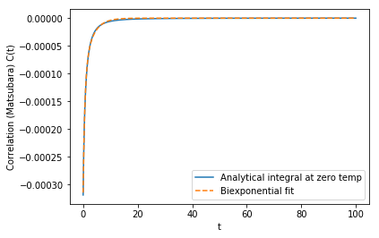

# matsubara
## Modelling the ultra-strongly coupled spin-boson model with unphysical modes
Neill Lambert, Shahnawaz Ahmed, Mauro Cirio, Franco Nori

The is the code to reproduce the results in [arXiv:1903.05892](https://arxiv.org/abs/1903.05892). A special `matsubara.heom.HeomUB` class is provided to implement the Hierarchical Equations of Motion method adapted for the underdamped Brownian motion spectral density.  

We focus on the zero temperature case where the correlation function can be expressed using four exponents - two "non-Matsubara" and two "Matsubara" exponents. The "Matsubara" exponents give rise to seemingly unphysical modes which nevertheless are essential to get correct physical results, e.g., virtual photon population.  

We also present a Reaction Coordinate method and a pseudomode approach to study the problem and show the crutial role of the Matsubara terms by effectively expressing them with a biexponential fit. 

Documentation, installation instructions and several examples are available at: [matsubara.readthedocs.io](matsubara.readthedocs.io)

# Installation
The code can be used in development mode by cloning the repository and performing an "in-place" installation using python.
```
git clone https://github.com/pyquantum/matsubara.git
cd matsubara
python setup.py develop
```
Numpy, Scipy and QuTiP are required. Install them with conda or pip if you do not already have them. Also, matplotlib is required for plotting.  

With [conda](https://www.anaconda.com/distribution/):

```
conda install numpy scipy qutip matplotlib
```

pip
```
pip install numpy scipy qutip matplotlib
```

The "in-place" installation means that everything gets installed from the local folder you downloaded it to and you can the changes to the code there will be immediately reflected system-wide, e.g., if you insert a print statement in some part of the code and then run your code, you will see it immediately. We hope this will allow you to change things and develop the code further. Please open a pull request if you want to add some features or find a bug.

# Examples

In `matsubara/docs/source/examples/` there are several examples from the paper which can be easily
reproduced. Just run them with python by going to the folder and the corresponding plots with be available in `matsubara/docs/source/examples/plots`.

```
python matsubara/docs/source/examples/positivity_constraint.py
```

The basic calcalation of the Matsubara and non Matsubara modes can be done in the following way:
```python
from matsubara.correlation import (nonmatsubara_exponents,
                                   matsubara_zero_exponents,
                                   biexp_fit, sum_of_exponentials)

coup_strength, bath_broad, bath_freq = 0.2, 0.05, 1.
tlist = np.linspace(0, 100, 1000)

# Zero temperature case beta = 1/kT
beta = np.inf
ck1, vk1 = nonmatsubara_exponents(lam, gamma, w0, beta)

# Analytical zero temperature calculation of the Matsubara correlation
mats_data_zero = matsubara_zero_exponents(lam, gamma, w0, tlist)

# Fitting a biexponential function
ck20, vk20 = biexp_fit(tlist, mats_data_zero)

print("Coefficients:", ck1, ck20)
print("Frequencies:", vk1, vk20)
```

```
Coefficients: [0., 0.02] [-0.00020, -0.00010]
Frequencies: [-0.025 + 0.99j, -0.025-0.99j] [-1.61 - 0.32]
```



# Documentation

The documentation is available at [matsubara.readthedocs.io](matsubara.readthedocs.io) but you can also build your own local version by modifying the `.RST` files in `docs/source/` and running the `make html` command from the docs folder. The documentation is build using `sphinx`. Please make sure you have [sphinx](http://www.sphinx-doc.org/en/master/) installed along with the dependency [sphinxcontrib-bibtex](https://sphinxcontrib-bibtex.readthedocs.io/en/latest/) for generating the bibliography.

Install sphinx with:

```
pip install -U Sphinx
pip install sphinxcontrib-bibtex sphinx_rtd_theme
```

Generate the docs:
```
cd matsubara/docs/
make html
```
