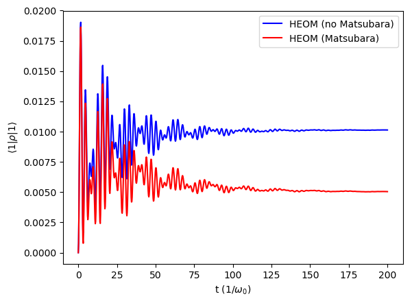

#################################
Hierarchical Eq. of Motion (HEOM)
#################################

.. code-block:: python

	import numpy as np
	from matsubara.correlation import (sum_of_exponentials, biexp_fit,
	                                   bath_correlation, underdamped_brownian,
	                                   nonmatsubara_exponents, matsubara_exponents,
	                                   matsubara_zero_analytical, coth)
	from qutip.operators import sigmaz, sigmax
	from qutip import basis, expect
	from qutip.solver import Options, Result, Stats

	from matsubara.heom import HeomUB

	import matplotlib.pyplot as plt

	Q = sigmax()
	wq = 1.
	delta = 0.
	coup_strength, cav_broad, cav_freq = 0.2, 0.05, 1.
	tlist = np.linspace(0, 200, 1000)
	Nc = 9
	Hsys = 0.5 * wq * sigmaz() + 0.5 * delta * sigmax()
	initial_ket = basis(2, 1)
	rho0 = initial_ket*initial_ket.dag()
	omega = np.sqrt(cav_freq**2 - (cav_broad/2.)**2)
	options = Options(nsteps=1500, store_states=True, atol=1e-12, rtol=1e-12)

	# zero temperature case, renormalized coupling strength
	beta = np.inf
	lam_coeff = coup_strength**2/(2*(omega))

	ck1, vk1 = nonmatsubara_exponents(coup_strength, cav_broad, cav_freq, beta)

	# Ignore Matsubara
	hsolver2 = HeomUB(Hsys, Q, lam_coeff, ck1, -vk1, ncut=Nc)
	output2 = hsolver2.solve(rho0, tlist, options)
	heom_result_no_matsubara = (np.real(expect(output2.states, sigmaz())) + 1)/2

	# Add zero temperature Matsubara coefficients
	mats_data_zero = matsubara_zero_analytical(coup_strength, cav_broad, cav_freq,
	tlist)
	ck20, vk20 = biexp_fit(tlist, mats_data_zero)
	hsolver = HeomUB(Hsys, Q, lam_coeff, np.concatenate([ck1, ck20]),
		             np.concatenate([-vk1, -vk20]), ncut=Nc)
	output = hsolver.solve(rho0, tlist, options)
	heom_result_with_matsubara = (np.real(expect(output.states, sigmaz())) + 1)/2

	plt.plot(tlist, heom_result_no_matsubara, color="b", label= r"HEOM (no Matsubara)")
	plt.plot(tlist, heom_result_with_matsubara, color="r", label=r"HEOM (Matsubara)")
	plt.xlabel("t ($1/\omega_0$)")
	plt.ylabel(r"$\langle 1 | \rho | 1 \rangle$")
	plt.legend()
	plt.show()

