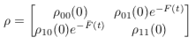
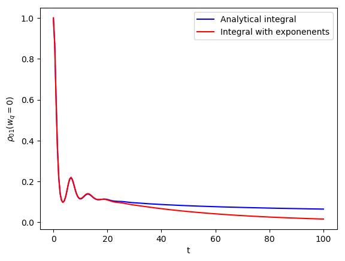

##############
Pure dephasing
##############

The analytical evolution of the density matrix in the pure dephasing case is given by

where F(t) is an integral which can be computed analytically in the zero temperature limit given that the correlation can be expressed as a sum of exponents. This analytical formula uses the Matsubara and non-Matsubara fitting exponents.

The exact evolution can be computed directly by a double integration of the correlation function from the underdamped Brownian motion spectral density. We can now compare both the results to see the error in the dynamics due to the fitting procedure.

We switch to a frame rotating with the qubit frequency and can thus set it to zero to see the dynamics due to the interaction only.

.. code-block:: python

	import numpy as np
	from numpy.testing import (run_module_suite, assert_,
	                           assert_array_almost_equal, assert_raises)

	from matsubara.pure_dephasing import (pure_dephasing_integrand,
	                                      pure_dephasing_evolution,
	                                      pure_dephasing_evolution_analytical)
	from matsubara.correlation import (biexp_fit, nonmatsubara_exponents, matsubara_exponents,
	                                   matsubara_zero_analytical)

	import matplotlib.pyplot as plt

	coup_strength, bath_broad, bath_freq = .8, .4, 1.

	tlist = np.linspace(0, 100, 200)

	# Set qubit frequency to 0 to see only the dynamics due to the interaction.
	wq = 0
	# Zero temperature case
	beta = np.inf
	ck1, vk1 = nonmatsubara_exponents(coup_strength, bath_broad, bath_freq, beta)

	mats_data_zero = matsubara_zero_analytical(coup_strength, bath_broad, bath_freq, tlist)
	ck20, vk20 = biexp_fit(tlist, mats_data_zero)

	ck = np.concatenate([ck1, ck20])
	vk = np.concatenate([vk1, vk20])

	pd_analytical = pure_dephasing_evolution(tlist, coup_strength, bath_broad,
	                                         bath_freq, beta, wq)
	pd_numerical_fitting = pure_dephasing_evolution_analytical(tlist, wq, ck, vk)

	plt.plot(tlist, pd_analytical, color="b", label="Analytical integral")
	plt.plot(tlist, pd_numerical_fitting, color="r", label = "Integral with exponenents")
	plt.xlabel("t")
	plt.ylabel(r"$\rho_{01}$($w_q = 0$)")
	plt.legend()
	plt.show()

