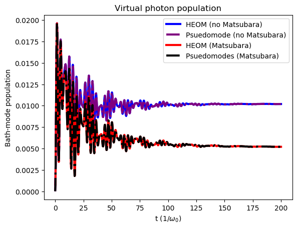

#########################
Virtual photon population
#########################

In the ultrastrong coupling regime (defined as where the qubit-environment coupling is on the order of the bath frequencies), the combined system-environment “groundstate”  contains a finite population of photons (and matter excitations) which in principle cannot be observed.  The Matsubara terms are crucial to both calculated the correct properties of this ¨groundstate¨, and make sure that the virtual excitations are trapped in that ground state.

In case of the pseudomode we calculate the expectation value of the non-Matsubara mode bath operators.  For the HEOM method, the Auxiliary Density Operators (ADOs) of the evolution contain  information about the bath operators :cite:`zhu2012explicit`, :cite:`song2017hierarchical` as shown in Eq (18) of :cite:`lambert2019virtual`. Here we show how to extract them from the full HEOM evolution.

.. code-block:: python

	import numpy as np
	from matsubara.correlation import (nonmatsubara_exponents,
	                                   matsubara_zero_analytical,
	                                   biexp_fit, sum_of_exponentials)

	from qutip.operators import sigmaz, sigmax
	from qutip import (basis, expect, tensor, qeye, destroy, mesolve, 
	                    spre, spost, liouvillian)
	from qutip.solver import Options, Result, Stats

	from matsubara.heom import HeomUB, get_aux_matrices
	import matplotlib.pyplot as plt

	# Extract virtual photon population from HEOM
	wq = 1.
	delta = 0.
	coup_strength, bath_broad, bath_freq = 0.2, 0.05, 1.
	Q = sigmax()

	tlist = np.linspace(0, 200, 1000)
	Nc = 9
	Hsys = 0.5 * wq * sigmaz() + 0.5 * delta * sigmax()
	initial_ket = basis(2, 1)
	rho0 = initial_ket*initial_ket.dag()
	omega = np.sqrt(bath_freq**2 - (bath_broad/2.)**2)
	options = Options(nsteps=1500, store_states=True, atol=1e-12, rtol=1e-12)

	# zero temperature case, renormalized coupling strength
	beta = np.inf
	lam_renorm = coup_strength**2/(2*(omega))

	ck1, vk1 = nonmatsubara_exponents(coup_strength, bath_broad, bath_freq, beta)

	# Ignore Matsubara
	hsolver_no_matsubara = HeomUB(Hsys, Q, lam_renorm, ck1, -vk1, ncut=Nc)
	output_no_matsubara = hsolver_no_matsubara.solve(rho0, tlist, options)

	# Add zero temperature Matsubara coefficients
	mats_data_zero = matsubara_zero_analytical(coup_strength, bath_broad, bath_freq,
											   tlist)
	ck20, vk20 = biexp_fit(tlist, mats_data_zero)
	hsolver_matsubara = HeomUB(Hsys, Q, lam_renorm, np.concatenate([ck1, ck20]),
		                       np.concatenate([-vk1, -vk20]), ncut=Nc)
	output = hsolver_matsubara.solve(rho0, tlist, options)

	# Get the auxiliary density matrices from the full Hierarchy ADOs
	aux_2_list, indices1 = get_aux_matrices(hsolver_no_matsubara.full_hierarchy, 2, Nc, 2)
	aux_2_list_matsubara, indices2 = get_aux_matrices(hsolver_matsubara.full_hierarchy, 2, Nc, 4)
	virtual_photon_heom_no_matsubara = np.array([aux.tr() for aux in aux_2_list[1]])
	virtual_photon_heom_matsubara = np.array([aux.tr() for aux in aux_2_list_matsubara[8]])

	# =======================================
	# Compute the population from pseudomode
	# =======================================
	print("pseudomode")
	lam2 = np.sqrt(lam_renorm)
	Ncav = 4

	# Construct the pseudomode operators with one extra underdamped pseudomode
	sx = tensor(sigmax(), qeye(Ncav))
	sm = tensor(destroy(2).dag(), qeye(Ncav))
	sz = tensor(sigmaz(), qeye(Ncav))
	a = tensor(qeye(2), destroy (Ncav))

	Hsys = 0.5*wq*sz + 0.5*delta*sx + omega*a.dag()*a + lam2*sx*(a + a.dag())
	initial_ket = basis(2, 1)
	psi0=tensor(initial_ket, basis(Ncav, 0))

	options = Options(nsteps=1500, store_states=True, atol=1e-13, rtol=1e-13)
	c_ops = [np.sqrt(bath_broad)*a]
	e_ops = [sz, sm.dag(), a, a.dag(), a.dag()*a, a**2, a.dag()**2]
	pseudomode_no_mats = mesolve(Hsys, psi0, tlist, c_ops, e_ops, options=options)
	output = (pseudomode_no_mats.expect[0] + 1)/2

	# Construct the pseudomode operators with three extra pseudomodes
	# One of the added modes is the underdamped pseudomode and the two extra are
	# the matsubara modes.
	sx = tensor(sigmax(), qeye(Ncav), qeye(Ncav), qeye(Ncav))
	sm = tensor(destroy(2).dag(), qeye(Ncav), qeye(Ncav), qeye(Ncav))
	sz = tensor(sigmaz(), qeye(Ncav), qeye(Ncav), qeye(Ncav))
	a = tensor(qeye(2), destroy(Ncav), qeye(Ncav), qeye(Ncav))

	b = tensor(qeye(2), qeye(Ncav), destroy(Ncav), qeye(Ncav))
	c = tensor(qeye(2), qeye(Ncav), qeye(Ncav), destroy(Ncav))

	lam3 =1.0j*np.sqrt(-ck20[0])
	lam4 =1.0j*np.sqrt(-ck20[1])

	Hsys = 0.5*wq*sz + 0.5*delta*sx + omega*a.dag()*a + lam2*sx*(a + a.dag())
	Hsys = Hsys + lam3*sx*(b+b.dag())
	Hsys = Hsys + lam4*sx*(c + c.dag())

	psi0 = tensor(initial_ket, basis(Ncav,0), basis(Ncav,0), basis(Ncav,0))
	c_ops = [np.sqrt(bath_broad)*a, np.sqrt(-2*vk20[0])*b, np.sqrt(-2*vk20[1])*c]
	e_ops = e_ops = [sz, sm.dag(), a, a.dag(), a.dag()*a, a**2, a.dag()**2]
	L = -1.0j*(spre(Hsys)-spost(Hsys)) + liouvillian(0*Hsys,c_ops)
	pseudomode_with_mats = mesolve(L, psi0, tlist, [], e_ops, options=options)

	# Plot the bath populations
	# Strange bug related to time steps in mesolve. 

	plt.plot(tlist[1:], np.real(virtual_photon_heom_no_matsubara), "-", color="b", linewidth=3, label = r"HEOM (no Matsubara)")
	plt.plot(tlist, np.real(pseudomode_no_mats.expect[4]), linestyle="-.",  color="purple", linewidth = 3, label = r"Psuedomode (no Matsubara)")
	plt.plot(tlist[1:], np.real(virtual_photon_heom_matsubara), "-", linewidth=3,  color="r", label = r"HEOM (Matsubara)")
	plt.plot(tlist, np.real(pseudomode_with_mats.expect[4]), linestyle="-.", linewidth=3, color="black", label="Psuedomodes (Matsubara)")
	plt.title("Virtual photon population")
	plt.xlabel("t ($1/\omega_0$)")
	plt.ylabel("Bath-mode population")
	plt.legend()
	plt.show()

